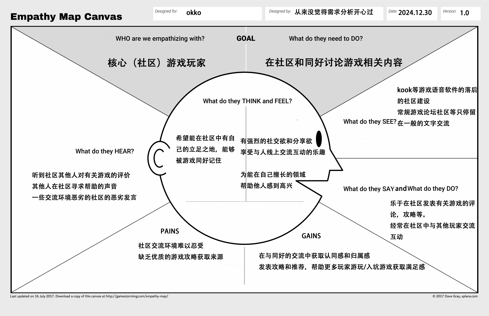

<h2 align="center">商业模式设计</h2>

从来没觉得需求分析开心过

2024年12月9日

## 一. 项目简介

### 1.1 团队成员

​	221900075 谢逸凡(PM)

​	221900230 徐贤博

​	221900309 周帛岑

​	221900324 段高翔

​	221900246 王子赟

### 1.2 度量数值

- 客户洞察部分的移情图：2个

- 构思部分的候选创意：

- 模型构建更新的画布内总要点数量：；关联关系：15个；引⽤的调研报告和新闻报道：5篇

- 讲故事部分的故事数量：2个

- 场景要点数量：个

### 1.3 文档简介

### 1.4 视频链接

## 二. 客户洞察

### 2.1 普通游戏玩家

#### 2.1.1 移情图

​	//image

#### 2.1.2 移情图分析

- 看：
- 听：
- 想与感受：
- 说与做：
- 痛点：自动排查音质（麦克风），根本不需要自带的某些非核心（社区）功能
- 收益：高质量的语音体验，一站式体验

### 2.2  社区用户

#### 2.2.2

- 看：
- 听：
- 想与感受：
- 说与做：
- 痛点：没有优质内容推送，缺乏运营，缺乏高质量二创
- 收益：问题及时反馈，游戏内容交流，大饱眼福

### 2.2 社区

#### 2.2.1 移情图

#### 2.2.2 移情图分析

- 看：

  游戏论坛和社区缺乏更丰富的互动形式，比如高质量的图文攻略、实时语音互动或有吸引力的插件，整体停留在较低层次的交流表现;同时一些同类型平台的社区建设也较为落后，难以支撑这样的内容存在

- 听：

  经常听到社区里其他玩家对游戏的评价和讨论，也能听到一些人在社区寻求帮助的声音，但同时也会碰到因故意恶心他人的恶劣发言，影响了整体的社区氛围。

- 想与感受：

  希望在社区中找到自己的立足之地，能被同好认可和记住，同时有强烈的社交和分享欲，享受线上互动的乐趣；渴望在自己擅长的领域帮助他人

- 说与做：

  乐于在社区中分享自己对游戏的评价、攻略和心得；积极与其他玩家互动交流，参与社区讨论，为社区氛围贡献自己的力量

- 痛点：

  常常会因为交流环境恶劣而感到不满，需多社区中存在恶劣钓鱼发言，破坏了交流体验；优质游戏攻略获取困难的问题，缺乏可靠稳定的内容来源和分享渠道。

- 收益：

  在与同好玩家的交流中获得认同感和归属感；通过发表游戏攻略、心得和推荐，帮助更多玩家体验游戏的乐趣，并在帮助他人的过程中获得满足感和成就感。

## 三. 构思

### 3.1 候选商业模式创意

#### 3.1.1 资源驱动--邀请中等规模游戏品牌官方入驻

**驱动因素**：用户的活跃度和留存率是是评判平台能否持续发展的重要标准，而知名游戏品牌（尚未形成封闭社区）具有天然的粉丝吸引力

**如果平台邀请中等规模游戏品牌官方入驻会怎样**：

- 无论是打造《犹格索托斯的庭院》的骨钉工作室，还是《星露谷物语》这种独立开发者，这些游戏品牌都具备一批高黏性用户，是原始的粉丝积累，同时，这些品牌的高黏性用户会自发地组织讨论、分享内容，从而形成社区驱动的正反馈循环。
- 通过品牌官方的直接入驻，可以在平台内打造专属讨论板块、活动或定制内容（如主题语音房间、游戏内置表情）。这些功能能够提升玩家的归属感和互动频率，进一步活跃社群。独立开发者与平台合作，也可加强内容创作者和玩家之间的联动，例如开发者 Q&A、粉丝联动创意活动等。
- 官方的入驻会增加在核心玩家群体中的认可度，形成口碑效应

**对整个商业模式画布的影响**：

- 与游戏品牌的合作成本增加
- 扩充关键资源——中等规模游戏品牌的合作权
- 扩充社区价值主张——打造以游戏品牌为核心的社区生态

#### 3.1.2客户驱动——引入插件机制实现客制化客户端

**驱动因素：** 用户在平台上的需求越来越多样化，不同用户对本软件有不同的需求。通过插件机制，可以为不同类型的用户提供个性化的功能和体验，从而提升平台的吸引力和用户粘性。

**如果平台引入插件机制会怎么样？**

- **重度游戏玩家**可以通过安装游戏攻略辅助插件，实时查看任务指导、技能推荐、敌人弱点等内容，提升游戏体验并帮助提高游戏表现。
- **社区玩家**可以根据兴趣选择不同的社区功能插件，如活动通知、话题讨论、群组管理等，增加社区互动和用户参与感。
- 通过插件机制，软件可以做到轻量化和定制化，从而吸引更多用户
- 平台可以提供插件市场，用户可以浏览、购买或免费下载各类插件，根据需求自定义自己的客户端。
- 插件可以通过API与平台进行无缝集成，确保用户在安装和使用插件时不会影响平台的核心功能和性能。
- 提供插件评分和评论系统，鼓励用户分享使用体验，帮助其他用户选择适合的插件。

**对整个商业模式画布的影响：**
- 收入来源：平台可以通过提供高级插件订阅、收取插件开发者的分成等方式增加收入。
- 扩充了关键资源：引入插件开发工具和API接口，平台需要提供对插件开发者的支持和文档。
- 价值主张：提供高度客制化的客户端体验，满足不同类型用户（如重度游戏玩家和社区玩家）的特定需求，提高平台的灵活性和用户满意度。
- 客户关系：通过个性化插件增强与用户的互动，提升用户的归属感和粘性。
- 渠道通路：插件市场和推荐系统可以作为吸引新用户的重要手段，用户通过分享和推荐插件，平台可以提高用户活跃度和推广效果。
- 成本结构：平台需要投入开发插件管理系统、市场和插件审核机制等资源，确保插件生态的健康发展。

#### 3.1.3 客户驱动——社区内容深度化和核心化

**驱动因素**：国内的discord软件，其社区多为强竞技类联机pvp游戏圈，内容以寻找搭子为主，其社区内容的轻度化严重影响PVE游戏玩家或联机休闲玩家的社区体验——无法寻找高质量的讨论或分享，进而导致无法真正形成良好活跃度的生态

**如果平台推动社区内容深度化、核心化会怎样**：

- 最有效的莫过于推荐机制，这能有效抑制水军、广告党、喷子的涌入，有效区分出核心玩家，但这也会使得新玩家流入变缓

- 引入主题化讨论板块（如特定游戏专区或游戏机制深度剖析），提供帖子功能，可以吸引更多重度玩家参与讨论，提升平台粘性，同时优化内容层次感，为玩家提供不同深度的参与选项。
- 利用语音房间举办“开发者问答”、“创作者分享会”等特色活动，加强玩家与游戏开发者之间的联系，营造更强的社区归属感。
- 鼓励玩家创作并分享原创内容（如攻略、同人作品、MOD创意），通过激励机制（如荣誉系统、奖励积分、置顶优质内容）形成社区驱动的内容创作循环，进一步提升内容的核心竞争力。
- 开发针对PVE玩家需求的特色工具，例如团队规划功能（自动匹配同等进度玩家）、副本日历（记录玩家攻略进度）等，提升玩家间的协作体验。针对游戏内容的分享需求，推出多媒体讨论支持（如嵌入游戏录像、实时分享战斗数据）。

**对整个商业模式画布的影响**：

- 价值主张：提供主题化、深度化的社区内容，让用户能在平台上获取不同于其他类discord语音软件的独特价值。

- 客户细分：重度玩家及核心粉丝群体，这些用户对游戏内容的深入讨论和创作更感兴趣，愿意为优质内容和服务付费。内容创作者群体，如攻略编写者、同人创作者等，他们通过创作获取成就感和曝光机会。

- 成本结构：增加内容深度化功能的开发维护费用和激励用户原创内容的奖励支出

#### 3.1.4 社交驱动——游戏成就分享与挑战系统

**驱动因素**：玩家在游戏中取得成就时，往往希望与他人分享喜悦，同时挑战系统可以激发玩家的竞争欲望，增加用户粘性。效仿steam等游戏平台的成就系统，本软件可以推出更加社区化、互动性的成就系统，这更加接近游戏社区的集成模式。此外，结合官方推出的游戏挑战，可以进一步提高社区活跃度。

**如果游戏语音软件集成游戏成就分享与挑战系统会怎样**：

- 玩家在游戏中达成特定成就时，软件可以自动捕捉并分享到语音聊天室或社交平台，增加玩家的成就感和社交互动。此处的成就既可以包括单机游戏中的进度里程碑，也可以包括联机游戏中的多杀、高光Highlight等画面。
- 集成排行榜，展示玩家的成就和挑战完成情况，增加玩家之间的竞争和互动，也可以让游戏玩家直观看到好友的游戏进度。
- 玩家可以围绕成就和挑战进行讨论，分享攻略，增强社区的活跃度。结合成就系统进行社区推送，也可以协助形成良性的社区讨论环境。
- 社区可以开展日常或季节性挑战活动，鼓励玩家完成特定任务，如“一周内完成n场比赛”或“高光时刻挑战”等，完成后可获得特殊奖励，这样同样能够鼓励玩家积极参与游戏和社区活动。开展活动也可以与相关游戏官方或其他主办方联动，进行软件的宣传活动。

**对整个商业模式画布的影响**：

- 价值主张：提供玩家成就展示和挑战参与的平台，增强游戏的社交和竞争体验。

- 客户细分：游戏成就追求者、竞技型玩家、社交型玩家。

- 客户关系：通过成就分享和挑战系统，增强玩家之间的互动和社区归属感。

- 合作伙伴：游戏开发商、社交平台、电竞赛事组织者。

#### 3.1.5

### 3.2 最终确定的商业模式创意

​	//todo

## 四. 视觉化思考

### 4.1 可视化画布

​	//image

### 4.2 相关分析说明

## 五. 模型构建

### 5.1 更新过的商业模式画布

### 5.2 市场潜力预估

- 随着年轻一代（特别是Z世代和千禧一代）成为主要的社交和游戏用户，他们更加倾向于选择娱乐、自由且具有高互动性的社交平台。另一方面，自疫情以来，全球经济增长放缓。在经济压力和生活节奏加快的背景下下，用户倾向于转向更经济高效的娱乐方式，例如游戏。实时语音沟通软件的免费基础功能和多元互动性使其可能成为用户替代传统娱乐（如实体活动）的选择。2023年，中国游戏市场规模已达到**472亿美元**（约合人民币3,300亿元），并且游戏玩家群体持续扩大。中国已经成为全球最大的视频游戏市场之一。[^1]
- 尽管在中国市场上，类Discord的语音沟通软件层出不穷，但由于各自存在一定的局限性，目前仍没有一款产品能够占据市场主导地位。然而，随着AI技术在语音识别、内容审核、推荐系统等领域的不断发展，类Discord产品迎来了创新的机遇。这为我们的产品OKKO提供了通过差异化功能和智能化体验脱颖而出的可能性。

[^1]:《2023年中国游戏产业报告》

### 5.3 要点联系

#### 5.3.1 画布感性端要点联系

**游戏玩家、专属私人服务、自动化服务、AI驱动**

个体游戏玩家使用产品时，自动化服务能解决大部分玩家会面对的问题，而专属私人服务能为高价值群体提供更好的产品体验，这两种服务需要AI驱动作为技术支援。

**游戏玩家、兴趣小组、社区、定制化、客户共同创造**

社区由诸多个体游戏玩家、结构松散的兴趣小组结合而形成，定制化的服务为社区提供高效便捷的管理方法，一个社区想要发展壮大，需要其中的客户共同为社区创造有价值的、有吸引力的内容。

**web链接、PC端、移动端APP、多平台跨终端支持、便利性**

软件具有web链接、PC端、移动端APP三种使用渠道，且做到了多平台跨终端支持和数据共享，满足了用户在不同环境、不同条件下的种种需求，体现其便利性。

**活跃激励、会员增值服务、广告、流量变现**

软件为活跃用户提供包含会员体验、相关游戏福利等激励机制；同时将会员增值服务与广告部分关联，使得用户在体验过会员增值服务后选择继续购买服务；活跃激励中的游戏福利部分可以考虑娱乐游戏厂商进行合作，达到流量变现。

**第三方从业者、品牌联动、社区、用户获取与增长**

可以借助与具有一定知名度的品牌联动，吸引相关品牌的用户及第三方从业者，同时借助社区进行宣传，扩大品牌联动带来的影响力。

**远程团队、便利性、专属私人服务**

对于专业性质较强的远程团队，软件需要在便利性上占据优势，同时利用专属私人服务提高团队之间的交流沟通体验。

**技术合作与服务、AI驱动、高质量语音体验、技术基础设施成本**

软件具有以AI驱动为核心的高质量语音传输技术，可以以此与其他厂商进行技术合作与服务，同时间接降低技术基础设施成本。

#### 5.3.2 画布理性端要点联系

**用户获取与增长、营销与广告费用、广告商、第三方内容提供商**

软件运营初期需要花费一定的广告费用拓宽用户市场和知名度，需与广告商达成合作，同时也可以联系一些第三方内容提供商，做一些必要的营销。

**高质量语音体验、多平台跨终端支持、AI驱动、技术平台与基础设施**

在技术平台与基础设施的基础上，软件需要结合AI驱动，在手机、电脑、网页端等多平台上实现跨终端的语音支持，同时要确保通话的高质量。

**与游戏的整合和合作、一站式**

通过与更多的游戏进行合作，软件能够整合游戏信息，在软件中提供额外的游戏启动、辅助播报、高光保存等功能，构建一站式的以语音为核心的游戏平台。

**广告、会员增值服务、研发和运营成本、平台开发和优化**

为了持续进行软件的功能更新与维护，需要进行平台开发和优化，其需要的研发和运营成本将主要由软件内投放的第三方广告和提供的会员增值服务提供。

**用户获取与增长、品牌和市场认可度、电竞团队和直播平台、品牌联动**

在软件持续运营周期中，需要通过提高品牌和市场认可度来保证用户的获取与增长。这不仅需要上面所说软件的持续功能更新与维护，更加贴近用户需求，还需要进行品牌联动，邀请电竞团队入驻或与直播平台达成联动。

### 5.4 支撑事实（新闻、调研及分析）

## 六. 讲故事

### 6.1 公司视角

### 6.2 客户视角(来自xxx移情图)

## 七.  场景

​	//**对（**5**）中的客户视角故事设置客户与产品交互的场景**，需体现

出客户如何了解并评估产品、购买并获得产品、与产品交互、以及产品售后、客户

对产品的评价与再次购买，**建议突出场景与客户的连接（设计多个用户“交互点”）**

