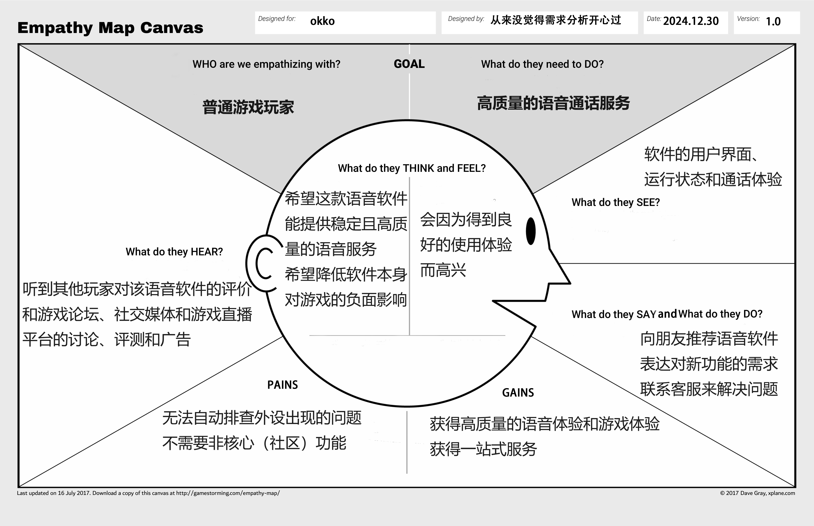

<h2 align="center">商业模式设计</h2>

从来没觉得需求分析开心过

2024年12月9日

## 一. 项目简介

### 1.1 团队成员

​	221900075 谢逸凡(PM)

​	221900230 徐贤博

​	221900309 周帛岑

​	221900324 段高翔

​	221900246 王子赟

### 1.2 度量数值

- 客户洞察部分的移情图：**2**个

- 构思部分的候选创意：**4**个

- 模型构建更新的画布内总要点数量：**40**个；关联关系：**15**个

- 讲故事部分的故事数量：**2**个

- 场景要点数量**：10个**

### **1.3 文**档简介

### 1.4 视频链接

## 二. 客户洞察

### 2.1 轻度游戏玩家

#### 2.1.1 移情图

#### 2.1.2 移情图分析

- 看：

  软件的用户界面（UI），包括按钮、图标和布局，清晰的指引和导航；软件在游戏过程中的运行状态，包括连接延迟，内存占用等；软件的语音通话体验，包括音质的稳定性和清晰度，以及是否有噪音、回声或延迟等

- 听：

  会听到其他玩家对该语音软件的评价和讨论和对于相关软件的推荐；游戏论坛、社交媒体和游戏直播平台的讨论、评测和广告会影响玩家选择语音软件

- 想与感受：

  希望这款语音软件能提供稳定且高质量的语音服务，满足他们在游戏中的沟通需求；希望能降低软件本身对游戏的负面影响，比如卡顿和延迟

- 说与做：

  使用软件与朋友进行语音聊天或游戏联机，向朋友推荐该语音软件；表达对软件新功能的需求；在遇到问题时，查询或联系客服来解决问题

- 痛点：

  游戏玩家可能需要自动排查麦克风和扬声器的相关问题，并且在必要时自动修复问题；游戏玩家可能不需要语音软件自带的某些非核心（社区）功能，这些功能可能会分散他们的注意力或增加软件的复杂性

- 收益：

  游戏玩家希望通过语音软件获得高质量的语音体验和游戏体验，这包括清晰的音质和稳定的连接。游戏玩家希望能够在一个平台上获得一站式服务，包括语音沟通、游戏加速或社交功能，这样可以提高他们的游戏效率和乐趣。
### 2.2  硬核（社区）游戏玩家
  普通游戏玩家希望通过语音软件获得高质量的语音体验和游戏体验；游戏玩家希望能够在一个平台上获得一站式服务，包括语音沟通、游戏加速或社交功能等

#### 2.2.1 移情图

#### 2.2.2 移情图分析

- 看：

  游戏论坛和社区缺乏更丰富的互动形式，比如高质量的图文攻略、实时语音互动或有吸引力的插件，整体停留在较低层次的交流表现；同时一些同类型平台的社区建设也较为落后，难以支撑这样的内容存在

- 听：

  经常听到社区里其他玩家对游戏的评价和讨论，也能听到一些人在社区寻求帮助的声音，但同时也会碰到因故意恶心他人的恶劣发言，影响了整体的社区氛围。

- 想与感受：

  希望在社区中找到自己的立足之地，能被同好认可和记住，同时有强烈的社交和分享欲，享受线上互动的乐趣；渴望在自己擅长的领域帮助他人

- 说与做：

  乐于在社区中分享自己对游戏的评价、攻略和心得；积极与其他玩家互动交流，参与社区讨论，为社区氛围贡献自己的力量

- 痛点：

  常常会因为交流环境恶劣而感到不满，需多社区中存在恶劣钓鱼发言，破坏了交流体验；优质游戏攻略获取困难的问题，缺乏可靠稳定的内容来源和分享渠道。

- 收益：

  在与同好玩家的交流中获得认同感和归属感；通过发表游戏攻略、心得和推荐，帮助更多玩家体验游戏的乐趣，并在帮助他人的过程中获得满足感和成就感。

## 三. 构思

### 3.1 候选商业模式创意

#### 3.1.1 资源驱动--邀请中等规模游戏品牌官方入驻

**驱动因素**：用户的活跃度和留存率是是评判平台能否持续发展的重要标准，而知名游戏品牌（尚未形成封闭社区）具有天然的粉丝吸引力

**如果平台邀请中等规模游戏品牌官方入驻会怎样**：

- 无论是打造《犹格索托斯的庭院》的骨钉工作室，还是《星露谷物语》这种独立开发者，这些游戏品牌都具备一批高黏性用户，是原始的粉丝积累，同时，这些品牌的高黏性用户会自发地组织讨论、分享内容，从而形成社区驱动的正反馈循环。
- 通过品牌官方的直接入驻，可以在平台内打造专属讨论板块、活动或定制内容（如主题语音房间、游戏内置表情）。这些功能能够提升玩家的归属感和互动频率，进一步活跃社群。独立开发者与平台合作，也可加强内容创作者和玩家之间的联动，例如开发者 Q&A、粉丝联动创意活动等。
- 官方的入驻会增加在核心玩家群体中的认可度，形成口碑效应

**对整个商业模式画布的影响**：

- 与游戏品牌的合作成本增加
- 扩充关键资源——中等规模游戏品牌的合作权
- 扩充社区价值主张——打造以游戏品牌为核心的社区生态

#### 3.1.2客户驱动——引入插件机制实现客制化客户端

**驱动因素：** 用户在平台上的需求越来越多样化，不同用户对本软件有不同的需求。通过插件机制，可以为不同类型的用户提供个性化的功能和体验，从而提升平台的吸引力和用户粘性。

**如果平台引入插件机制会怎么样？**

- 用户可以通过安装游戏攻略辅助插件，实时查看任务指导、技能推荐、敌人弱点等内容，提升游戏体验并帮助提高游戏表现。
- 用户可以根据兴趣选择不同的社区功能插件，如活动通知、话题讨论、群组管理等，增加社区互动和用户参与感。
- 通过插件机制，软件可以做到轻量化和定制化，从而吸引更多用户
- 平台可以提供插件市场，用户可以浏览、购买或免费下载各类插件，根据需求自定义自己的客户端。
- 插件可以通过API与平台进行无缝集成，确保用户在安装和使用插件时不会影响平台的核心功能和性能。
- 提供插件评分和评论系统，鼓励用户分享使用体验，帮助其他用户选择适合的插件。

**对整个商业模式画布的影响：**
- 收入来源：平台可以通过提供高级插件订阅、收取插件开发者的分成等方式增加收入。
- 扩充了关键资源：引入插件开发工具和API接口，平台需要提供对插件开发者的支持和文档。
- 价值主张：提供高度客制化的客户端体验，满足不同类型用户（如硬核游戏玩家和轻度游戏玩家）的特定需求，提高平台的灵活性和用户满意度。
- 客户关系：通过个性化插件增强与用户的互动，提升用户的归属感和粘性。
- 渠道通路：插件市场和推荐系统可以作为吸引新用户的重要手段，用户通过分享和推荐插件，平台可以提高用户活跃度和推广效果。
- 成本结构：平台需要投入开发插件管理系统、市场和插件审核机制等资源，确保插件生态的健康发展。

#### 3.1.3 客户驱动——社区内容深度化和核心化

**驱动因素**：国内的discord软件，其社区多为强竞技类联机pvp游戏圈，内容以寻找搭子为主，其社区内容的轻度化严重影响PVE游戏玩家或联机休闲玩家的社区体验——无法寻找高质量的讨论或分享，进而导致无法真正形成良好活跃度的生态

**如果平台推动社区内容深度化、核心化会怎样**：

- 最有效的莫过于推荐机制，这能有效抑制水军、广告党、喷子的涌入，有效区分出核心玩家，但这也会使得新玩家流入变缓

- 引入主题化讨论板块（如特定游戏专区或游戏机制深度剖析），提供帖子功能，可以吸引更多重度玩家参与讨论，提升平台粘性，同时优化内容层次感，为玩家提供不同深度的参与选项。
- 利用语音房间举办“开发者问答”、“创作者分享会”等特色活动，加强玩家与游戏开发者之间的联系，营造更强的社区归属感。
- 鼓励玩家创作并分享原创内容（如攻略、同人作品、MOD创意），通过激励机制（如荣誉系统、奖励积分、置顶优质内容）形成社区驱动的内容创作循环，进一步提升内容的核心竞争力。
- 开发针对PVE玩家需求的特色工具，例如团队规划功能（自动匹配同等进度玩家）、副本日历（记录玩家攻略进度）等，提升玩家间的协作体验。针对游戏内容的分享需求，推出多媒体讨论支持（如嵌入游戏录像、实时分享战斗数据）。

**对整个商业模式画布的影响**：

- 价值主张：提供主题化、深度化的社区内容，让用户能在平台上获取不同于其他类discord语音软件的独特价值。

- 客户细分：重度玩家及核心粉丝群体，这些用户对游戏内容的深入讨论和创作更感兴趣，愿意为优质内容和服务付费。内容创作者群体，如攻略编写者、同人创作者等，他们通过创作获取成就感和曝光机会。

- 成本结构：增加内容深度化功能的开发维护费用和激励用户原创内容的奖励支出

#### 3.1.4 客户驱动——游戏成就分享与挑战系统

**驱动因素**：玩家在游戏中取得成就时，往往希望与他人分享喜悦，同时挑战系统可以激发玩家的竞争欲望，增加用户粘性。效仿steam等游戏平台的成就系统，本软件可以推出更加社区化、互动性的成就系统，这更加接近游戏社区的集成模式。此外，结合官方推出的游戏挑战，可以进一步提高社区活跃度。

**如果游戏语音软件集成游戏成就分享与挑战系统会怎样**：

- 玩家在游戏中达成特定成就时，软件可以自动捕捉并分享到语音聊天室或社交平台，增加玩家的成就感和社交互动。此处的成就既可以包括单机游戏中的进度里程碑，也可以包括联机游戏中的多杀、高光Highlight等画面。
- 集成排行榜，展示玩家的成就和挑战完成情况，增加玩家之间的竞争和互动，也可以让游戏玩家直观看到好友的游戏进度。
- 玩家可以围绕成就和挑战进行讨论，分享攻略，增强社区的活跃度。结合成就系统进行社区推送，也可以协助形成良性的社区讨论环境。
- 社区可以开展日常或季节性挑战活动，鼓励玩家完成特定任务，如“一周内完成n场比赛”或“高光时刻挑战”等，完成后可获得特殊奖励，这样同样能够鼓励玩家积极参与游戏和社区活动。开展活动也可以与相关游戏官方或其他主办方联动，进行软件的宣传活动。

**对整个商业模式画布的影响**：

- 价值主张：提供玩家成就展示和挑战参与的平台，增强游戏的社交和竞争体验。

- 客户细分：游戏成就追求者、竞技型玩家、社交型玩家。

- 客户关系：通过成就分享和挑战系统，增强玩家之间的互动和社区归属感。

- 合作伙伴：游戏开发商、社交平台、电竞赛事组织者。

### 3.2 最终确定的商业模式创意

​	经过思考和讨论，我们决定整合创意（1）（3）（4）的内容，融入创意（2），最终确定如下的商业模式创意：

​	资源驱动和客户驱动整合，平台邀请独游开发者入驻等中等规模游戏品牌官方，定期利用语音房间举办“开发者问答”、“创作者分享会”等特色活动，引入主题化讨论板块，集成游戏成就分享与挑战系统，提高社区活跃度；同时研发插件系统，提供个性化体验。

## 四. 视觉化思考

### 4.1 可视化画布

### 4.2 相关分析说明

经过深入讨论和充分落实，我们团队创建了一份可视化的商业模式画布，构建了**OKKO**的核心商业框架。我们的业务核心聚焦于提供高质量的语音沟通服务，同时拓展社区管理、游戏整合等功能模块。针对这些业务，我们对客户群体进行了细分，其中，日常语音沟通需求的轻度游戏玩家是软件使用的主力军；其他核心群体包括硬核游戏玩家、内容创作者以及游戏开发商。其中，硬核游戏玩家和内容创作者在推动社区高效运转和创造优质内容方面发挥了关键作用。

我们的价值主张围绕高质量语音体验与一站式服务展开（OKKO不仅是一个工具，更是温暖的“小窝”，用户可以在OKKO启动游戏、导入歌单，甚至无缝切换至VS Code专注于代码创作），通过品牌联动与活跃激励机制，打造一个富有吸引力和生命力的社区，同时为用户提供便捷且定制化的体验。客户关系通过社区和平台联动的纽带建立起来，不仅为用户提供自助式服务，还依托AI驱动实现个性化推荐和精准匹配。此外，我们积极与电竞团队、第三方内容提供商以及知名游戏品牌商展开合作，共同丰富平台内容，营造专属的OKKO社区文化氛围。

OKKO以语音技术和社区为核心，其推广和运营渠道广泛，包括应用商店下载、社交媒体推广等。收入来源主要包括会员增值服务和平台广告收入。具体要点细节详见上次文档（蓝海战略探索）和创意内容

## 五. 模型构建

### 5.1 更新过的商业模式画布

### 5.2 市场潜力预估

- 随着年轻一代（特别是Z世代和千禧一代）成为主要的社交和游戏用户，他们更加倾向于选择娱乐、自由且具有高互动性的社交平台。另一方面，自疫情以来，全球经济增长放缓。在经济压力和生活节奏加快的背景下下，用户倾向于转向更经济高效的娱乐方式，例如游戏。实时语音沟通软件的免费基础功能和多元互动性使其可能成为用户替代传统娱乐（如实体活动）的选择。
- 尽管在中国市场上，类Discord的语音沟通软件层出不穷，但由于各自存在一定的局限性，目前仍没有一款产品能够占据市场主导地位。然而，随着AI技术在语音识别、内容审核、推荐系统等领域的不断发展，类Discord产品迎来了创新的机遇。这为我们的产品OKKO提供了通过差异化功能和智能化体验脱颖而出的可能性。

- 我们的产品OKKO真正实现了一站式体验，不仅注重功能的完善，更赋予产品温度。用户可以在平台上畅玩游戏、浏览社区，甚至专注于工作，满足多场景需求，这种独特的融合体验是其他同类产品所无法比拟的。

[^1]:《2023年中国游戏产业报告》

### 5.3 要点联系

**1. 专属私人服务、自助服务、AI驱动**

个体游戏玩家使用产品时，自助服务能解决大部分玩家会面对的问题，而专属私人服务能为高价值群体提供更好的产品体验，这两种服务需要AI驱动作为技术支援。

**2. 内容创作者、活跃激励和创作激励成本**

通过创作激励机制，吸引内容创作者在社区内分享优质内容，例如游戏攻略、心得交流等

**3. 社区、定制化、客户共同创造**

社区由个体游戏玩家和兴趣小组构成，通过提供定制化的管理工具，提高社区运作效率。同时，社区用户通过共同创造内容（如讨论、活动、分享），为社区的发展提供持久动力，形成积极的循环生态。

**4. 应用商店、web链接、多平台跨终端支持、便利性**

软件具有web链接、PC端、移动端APP三种使用渠道，且做到了多平台跨终端支持和数据共享，满足了用户在不同环境、不同条件下的种种需求，体现其便利性。

**5. 活跃激励、会员增值服务、广告**

软件为活跃用户提供包含会员体验、相关游戏福利等激励机制；同时将会员增值服务与广告部分关联（免广告），使得用户在体验过会员增值服务后选择继续购买服务；活跃激励中的游戏福利部分可以考虑娱乐游戏厂商进行合作，达到流量变现。

**6. 品牌联动、社区、提升社区活跃度**

可以借助与具有一定知名度的游戏品牌联动，吸引相关品牌的用户及第三方从业者，同时借助社区进行宣传，扩大品牌联动带来的影响力。

**7. AI驱动、高质量语音体验、技术基础设施成本**

软件具有以AI驱动为核心的高质量语音传输技术，给用户高质量语音体验。

**8. 游戏的整合和合作、一站式**

通过与更多的游戏进行合作，软件能够整合游戏信息，在软件中提供额外的游戏启动、辅助播报、高光保存等功能，构建一站式的以语音为核心的游戏平台。

**9. 广告、会员增值服务、平台开发和优化**

为了持续进行软件的功能更新与维护，需要进行平台开发和优化，其需要的成本将主要由软件内投放的第三方广告和提供的会员增值服务提供。

**10. 品牌和市场认可度、电竞团队、品牌联动**

在软件持续运营周期中，需要通过提高品牌和市场认可度来保证用户的获取与增长。这不仅需要上面所说软件的持续功能更新与维护，更加贴近用户需求，还需要进行品牌联动，邀请电竞团队入驻。

**11. AI驱动、数据分析与个性化服务、定制化**

利用AI驱动对用户的语音偏好、游戏历程等内容进行数据分析，从而为每个用户提供定制化、个性化的服务。

**12. AI驱动、客户共同创造、用户支持和内容审核成本**

将用户支持和内容审核任务部分下放到社区和用户手中，例如玩家评审、社区风纪官等，并通过AI驱动进一步对审核结果筛选、确认，从而节省用户支持和内容审核成本。

**13. 插件系统、一站式、定制化**

平台研发的插件系统支持第三方平台内嵌，让用户在享受完游戏后，能即时无缝切换到工作或者是休闲环境中，获得一站式体验；同时，用户可根据自己需求下载插件，定制化打造自己的软件

**14. 游戏成就分享与挑战系统、提升社区活跃度**

平台通过成就分享和挑战系统，增强玩家之间的互动和社区归属感

**15. 会员增值服务、定制化**

有进阶使用需求的用户可以开通平台会员，平台将收取⼀定的会员费用，为用户提供更加定制化的服务

### 5.4 支撑事实（新闻、调研及分析）

1. 从中国游戏产业结构看OKKO

> 2023年中国游戏产业发展主要数据和专业信息如下：
>
> 2023年，国内游戏市场实际销售收入3029.64亿元，同比增长13.95%，首次突破3000亿关口。
>
> 用户规模6.68亿人，同比增长0.61%，为历史新高点。
>
> .......
>
> 在细分市场中，移动游戏实销收入增幅明显，收入占比高达74.88%，继续占据主导地位；客户端游戏实销收入持续升高，占比21.88%；网页游戏继续萎缩，占比仅为1.57%。
>
> 2023年我国移动游戏市场实际销售收入2268.6亿元，同比增长17.51%，创下新的记录。
>
> 2023年，收入排名前100位移动游戏产品中，角色扮演类明显高于其他类型，占比31%；策略、卡牌占比分别为9%；射击和棋牌类占比，分别为7%。
>
> 2023年，国内客户端游戏市场实际销售收入662.83亿元，同比增长8%，主要得益于大型多人在线角色扮演游戏（MMORPG）收入稳定、头部电竞和二次元游戏收入持续增长以及更多新品在PC端同步发行等。
>
> ​										----------《2023年中国游戏产业报告》

- 报告显示，中国游戏市场规模和游戏用户规模持续扩大，OKKO的市场前景十分广阔。同时，报告指出，移动游戏和客户端游戏的收入持续增长，角色扮演游戏和MMORPG类型占据主流市场。这些游戏类型对于语音沟通工具的需求日益增加，以提升联机体验。
- 我们的产品OKKO针对不同游戏的特定需求，研发了定制化插件，为玩家提供量身打造的游戏体验。例如，对于《博德之门3》，我们推出了专门的插件，提供伤害计算和优化最大化等功能，满足了玩家在游戏中的个性化需求。通过这种方式，我们实现了对用户需求的精细化细分。

2. 如何理解并打造⼀款社区产品

> 既然文化、角色、内容是社区的基石，那么从0到1建立一个社区自然也是围绕着这三个点去着手进行的。
>
> ......
>
> **注重KOL，更要注重KOC**
>
> 决定一个社区能够走多快的是它的KOL，但决定一个社区能走多远的是它的KOC。
>
> 对于任何社区来说，KOL的重要性都不言而喻，尤其是在社区的启动阶段，KOL可以在短期内为社区带来一大批忠实的流量，即便是社区的成熟期，KOL也可以稳定住社区流量的基本盘。
>
> ......
>
> **3）打造角色等级体系的上升通道**
>
> 上瘾模型中说，用户对于一款产品上瘾基本分为“触发-行动-赏酬-投入”四个步骤。从中可以看出，如果想让用户对社区进行脑力和体力的投入之前，需要让他们获得多变的赏酬，而角色等级体系或者特权体系就是一种最常见的精神赏酬方式。
>
> 不论是内容生产者还是内容消费者，只要是做出符合社区价值的行为，就可以获得对应的虚拟收益，虚拟收益可以累计成对应等级，让角色之间自然而然的出现等级差异，这样促使他们相互进行攀比、炫耀，去持续创造符合社区价值的内容，这对于社区的发展是非常有必要的。
>
> ​									---------- 《如何理解并打造一款社区产品？》[^2]

- OKKO社区的独特点在于社区使用者多是游戏强相关的用户，这种高度聚焦的用户群体有效避免了其他社区中“云子”泛滥的问题，从而能够更好地营造专注讨论游戏的氛围。
- OKKO在倡导的“活跃激励”的价值主张上实际打造了一套奖励系统和等级划分。在客户细分里，硬核游戏玩家和内容创作者将作为社区精品内容的主要生产者，OKKO会为这些优质帖子提供创作激励和大神头衔，激励创作欲；同时，对于轻度游戏玩家，OKKO将对其的活跃程度提供头像框、气泡甚至实物奖励，从而鼓励他们持续参与社区活动。通过这种方式，OKKO不仅能够促进优质内容的产生，还能有效提高社区的活跃度和用户参与度，推动社区的长期发展。

[^2]:https://www.woshipm.com/pd/3559368.html

## 六. 讲故事

### 6.1 公司视角

 &emsp;钟正先生是一名资深游戏玩家**（客户细分——硬核游戏玩家）**，在一款传统语音软件TGB中担任“白吗喽”游戏社区的管理员，长期不满于TGB疏于社区管理和运营的行为。恰逢在TGB的社区年度评选中，“白吗喽”受到不公对待而落败于“宇宙萝卜头”，钟正先生遂愤而卸载TGB，纠集其他几位游戏社区资深人员，集资创办了另一款语音软件‘’OKKO’‘。

 &emsp;OKKO吸取了TGB的经验和教训，将主要资源投入到提高语音质量和稳定性方面。**（价值主张——高质量语音体验）** 为此，钟正先生挖来了TGB技术团队的两名资深工程师，在原有语音技术的基础上，借助大模型，迭代出来效率更高的降噪模型，同时，钟正先生租借一定量的服务器，高薪招募到了某大厂裁员而来的资深运营团队，设计出了更加简明便捷的UI界面和社区管理模式。**（关键业务——平台开发与技术优化、核心资源——开发和运营团队，语音技术与基础设施  ，成本结构——基础设施成本）** 在此基础上，OKKO决定在平台中加入广告以保证收入来源，并在B站等社交媒体上大力推广产品**（重要合作——广告商，营销团队）**

 &emsp; OKKO自研的插件系统也是一大亮点，通过自定义插件功能的安装，用户可以在游玩的同时，快捷调取来自OKKO社区甚至是第三方平台的攻略、资讯等内容，极大程度上方便了用户对“多线程“的需求。**（核心资源——插件系统，重要合作——第三方内容提供商）**  

 &emsp;随着用户群体不断增长，钟正先生意识到，平台的下一步发展不仅仅依赖于语音质量和广告变现，真正决定长期成败的，还是社区建设。于是，在本年度的公司总结大会上，钟正先生做了如下重要讲话：“语音市场，历代大规模商战五十余次，胜负成败难以论说。但玩家无不注意到，正是在社区市场，决定了多少家公司的盛衰兴亡、此兴彼落，所以未来必有社区致胜之说。**（价值主张——社区，关键业务——提升社区活跃度）** ”

​	场下高管纷纷赞同，钟正顺势邀请在座的鹅厂合作代表发表见解，介绍了他们当年是如何靠着扩大用户社区称霸文字聊天领域，并依靠用户在其社交网络的自发推广实现了看似不能完成的用户增长速度，从而有了今日的辉煌成果，OKKO也可以如法炮制。**（核心资源——用户群体和社交社区）** 

​	随后，钟正先生继续讲道：“两年半前，我从“白吗喽“社区踏上征途，开始了OKKO的创建，游戏语音市场遂添一新星。OKKO所到之处，游戏社区竭诚欢迎，真可谓占尽天时。”钟正先生向参会者制订了详细的社区建设计划，一则是借助现有资源联系游戏主播和职业选手，建立其社区分区，依靠他们的人气吸引粉丝前来OKKO，扩大对应游戏社区的用户规模，进而借助热度并邀请如《犹格索托斯的庭院》骨钉工作室等游戏品牌商官方入驻，为用户提供一手的游戏资讯的同时利用语音房间举办“开发者问答”、“创作者分享会”等特色活动。**（重要合作——电竞团队，游戏品牌商）** 二是借助大数据和AI技术优化推广算法，为玩家提供优质的推送内容，内容来源正好可以是达成合作的游戏官方，同时通过激励机制为创作优质社区内容或游戏定制插件的玩家，尤其是民间认可度高的攻略大佬之类，给予奖励，鼓励玩家间的创作交流。**（关键业务——与游戏的整合与合作，成本结构——活跃激励和创作激励成本）**

​	 “不管怎么讲，这次商战的用户基础是八百万对六百万，优势在我！”钟正先生以极具感染力的话语收尾，宣示着OKKO的发展进入了全新的阶段。

### 6.2 客户视角(来自轻度游戏玩家移情图)

  &emsp;小周是一名南京大学本科生，平时爱好打游戏。这几天暑假无聊，他和同学小段商量着一起玩Minecraft。**（客户细分——轻度游戏玩家）** 众所周知，和朋友玩游戏一定要开麦交流才有意思，纯靠打字不仅交流效率低，还影响一起游戏的体验。小周本想使用企鹅自带的企鹅语音和小段交流，奈何企鹅语音不仅音质不佳，还会出现识别不到麦克风等各种各样的bug。

  &emsp;这天两人晚上都有时间，一商量，决定找一个新的语音软件来改进语音体验。于是小周在ac站上搜索“语音软件”，映入眼帘的是一个名为“OKKO”的软件推广视频。**（渠道通路——社交媒体）** 小周打开了这个介绍视频，在简要浏览后，决定和小段一起下载这个软件试一试。在打开这个软件前小周其实没有抱着很大期望，但很快，二人就发现建立服务器、邀请他人并进行通话的操作非常简单，只需要一个人发送邀请链接，另一人点击链接加入服务器即可，不仅可以从手机app跨终端连接，甚至还可以便捷地从网页端链接直接进入。二人试着进行了几句对话来测试通话质量，结果通话连接稳定，也没有底噪，小周大喜过望，直呼：“从未如此美妙的开局！”**（价值主张——便利性、高质量语音体验、多平台跨终端支持）**

  &emsp;于是在同意了一些附加条款（实际上并没有细看）后，二人开始了愉快的开黑。游玩过程中，小段提出可以向整合包中加入几个新的模组来改善游戏体验。二人于是暂时关闭了游戏，去下载好了需要的模组。这时小周惊讶地发现，OKKO识别到了自己刚刚在玩Minecraft，并提供了游戏的专属启动插件页面，不仅可以在这里一键启动游戏，还能通过拖拽直接将模组压缩包直接添加到对应的版本文件夹中——这震撼了小周一万年，他从未见过其他语音软件有如此一站式的体验。**（价值主张——定制化、一站式）** 二人思考过后发现，这是刚刚自己忽略的附加条款中包含的拓展服务。

  &emsp;重新进入游戏后，小段对殖民地的范围拓展机制有些疑问，他发现OKKO在启动Minecraft后弹出了一个自助语音提问插件，于是小段点击语音输入并直接说出了问题，AI在进行语音转文字并搜索后，回复小段可以通过建设卫兵塔来扩展殖民地边界，这让小段感叹OKKO真是太方便了。**（客户关系——自助服务，价值主张——AI驱动）** 小周发现OKKO中存在一些原某、绝某某的广告，但是广告不跳脸，不影响正常使用。小周感到一丝庆幸，还好有正常的盈利手段，否则OKKO免费提供这么好的通话服务，总让人心里没底，属于是自己吓自己了。**（收入来源——广告）** 

  &emsp;在这次愉快的使用经历后，小周和小段开始长期使用OKKO进行游戏开黑通话，同时使用其附加功能来改进体验。随着使用程度的加深和游戏种类的增加，小周开通了会员增值服务来使用各种拓展功能——比如在玩无畏契约时自动录制并剪辑多杀操作，在玩鸣潮跑图时添加外置的地图标记和语音指引，又或者是增加可以同时使用的插件数量。**（客户关系——专属私人服务，收入来源——会员增值服务，关键业务——数据分析与个性化服务）** 

  &emsp;此外，小周开始使用OKKO的社区。在社区中有各种游戏的提问帖、收集帖，很多用户在这里互相解疑答惑、交流理解、寻找搭子，共同维护健康的社区环境。**（价值主张——社区，客户关系——社区）** 玩家在社区中可以查看彼此的游戏成就列表**（核心资源——游戏成就分享与挑战系统）**，社区也会不定时举办一些与游戏的联动活动，玩家们可以通过完成对应成就、达成活跃进度等方式来获取头像框、气泡甚至实物奖励。**（价值主张——活跃激励、品牌联动，关键业务——游戏的整合与合作）** 部分有技术的社区用户甚至参与到了OKKO开源插件的制作当中——经过审核和测试将被OKKO官方正式采用。**（客户关系——客户共同创造）** 这让小周回忆起了刚使用OKKO的那个晚上收获的惊喜。看着社区欣欣向荣，小周和小段也开始活跃在社区中，为建设更好的社区尽自己的一份力。

## 七.  场景

### 客户视角场景

​	小周是南京大学的计算机本科生，热衷于打游戏，如《鸣潮》和《Minecraft》。他常与同学小段等一同连麦开黑，但一直对现用的语音软件感到不满，尤其是音质差和社区过于轻量化。某天，他决定在AC站搜索替代品，正巧看到了OKKO的推广视频。在认真观看视频及评论后**（了解并评估产品）**，小周被OKKO主打的“高质量语音体验”深深吸引，认为这正符合他的需求。于是，他决定试用该软件并下载安装**（购买并获得产品）**。

​	初次进入OKKO后，小周立刻对其简洁大方的界面产生了好感——相比之前那些臃肿的语音软件，OKKO的界面显得更加清新、直观。随着进一步探索，小周发现OKKO的操作非常简单易懂，他迅速创建了自己的频道，并发送了《Minecraft》游戏链接给小段。两人进入频道后，OKKO贴心地检测了麦克风设置并进行了语音测试，结果通话清晰、稳定，且没有底噪音。两人欣喜若狂，立刻沉浸在游戏中，畅快开黑**（交互）**。

​	在游玩时，小周对游戏中的殖民地扩展机制产生了疑问，本打算去手机上查攻略时，却看到弹出了OKKO的自助语音提问插件。经过简单了解后，他发现这款插件是OKKO独立研发的AI攻略助手，插件库里还包含了多种其他实用工具。小周试着用语音向AI提出问题，AI将语音转文字后进行搜索，迅速回答了他通过建设卫兵塔扩展殖民地边界的方式，令小周对OKKO的便利性感到惊叹**（交互）**。经历了五小时的畅玩后，小周和小段都对OKKO的表现十分满意，便邀请更多同学加入频道**（评价）**。

​	休息时，小周安装了OKKO推荐的《Minecraft》相关社区插件，进入后被社区的活跃度和内容深深吸引：高质量的问答贴、分享帖，以及mod开发者的语音讨论房让他感到耳目一新。他在社区中回复了一些曾遇到过的bug问题，并收到了OKKO发放的优质创作奖励**（交互）**，极大提升了他参与社区建设的热情。

​	渐渐地，小周和他的同学们完全转向了OKKO，并在了解会员服务后，选择充值成为会员**（再次购买）**。随着插件使用权限的增加，小周也频繁收到OKKO推荐的个性化插件。**（售后）**他挑选了其中一些高评分的插件，极大提升了自己的游戏体验，并将代码日常与游戏生活无缝对接，实现一站式。小周和同学们感慨道：“这个OKKO真是好用啊，简直是为我们这种平常一起臭敲代码打游戏的量身打造的！”

​	如今，小周也会主动向那些和他有相似需求的人推荐OKKO。**（评价）**他对使用过的插件进行了评分，并将心得整理成分享帖上传到《Minecraft》社区，看到不断上涨的收藏数和来自社区成员的友善评论，他满意地退出了社区，启动内置的vsocde，期待下一次的互动**（交互）**。

