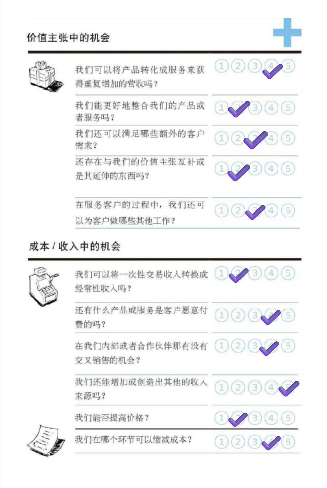
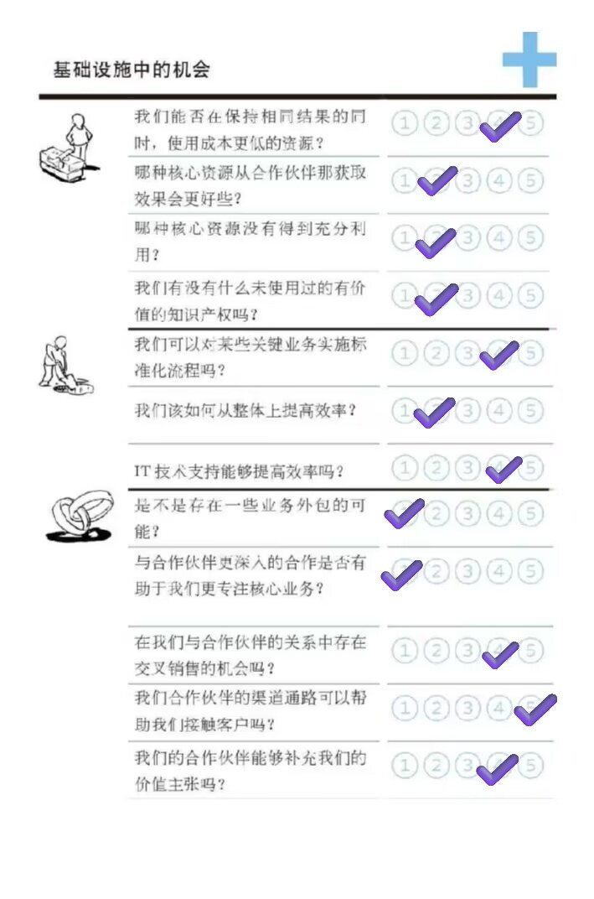
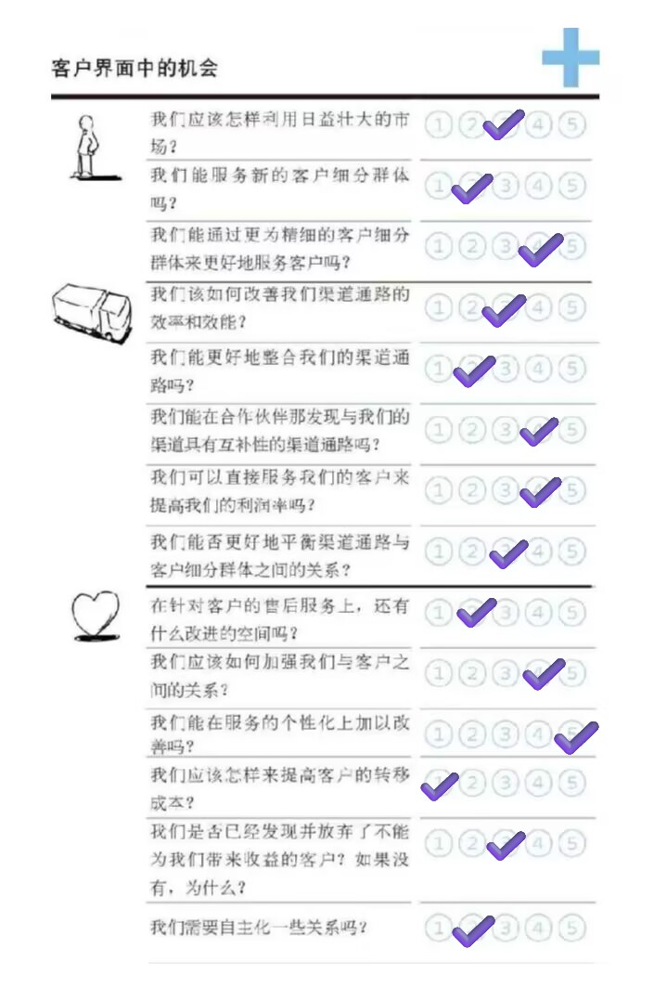

<h2 align="center">结果文档</h2>

从来没觉得需求分析开心过

2024年11月17日

## 1. 项目概要

### 1.1 项目选题

​	 一款面向社群的实时语音沟通软件OKKO

### 1.2  团队成员

​	221900075 谢逸凡

​	221900230 徐贤博

​	221900309 周帛岑

​	221900324 段高翔

​	221900246 王子赟

### 1.3 度量数值

- 本文档共包含 ？ 个要点与 11 个关联关系，平均要点数量约为？ 个。

- 要点之间的关联详见2.3 部分

- 调研报告数量：？

- 总体评估中的S维度6项，W维度4项，O维度4项，T维度4项  ;  加分项共10项,减分项共8项。总体共 18 项

## 2. 竞品商业模式画布与分析

### 2.1 竞品选择及理由

我们选择的竞品是KOOK，理由有如下几点：

1. **价值主张有共通性**

   KOOK着眼于社群驱动的社交需求，强调实时语音、多人互动和社交功能，其价值主张和我们的创意存在共通性。OKKO可以借鉴KOOK在这些方面的设计理念和实现方式，从而在同类产品中建立更强的竞争力。

2. **用户基础与目标群体相似**

   KOOK是一个以社群为基础的即时通讯工具，主要面向游戏玩家、兴趣小组、社区团体等用户群体。这与我们预想的客户群体高度重合。OKKO可以借鉴KOOK在这些领域的成功经验，尤其是在针对特定群体（如游戏玩家、二次元社群等）进行细分和运营方面的经验，打造更具吸引力的产品功能和用户互动模式。

3. **KOOK的典型性**

   KOOK作为一款成功的社群即时通讯工具，在国内市场具有一定的知名度，并在年轻用户群体中占有一席之地。它代表了一类典型的以语音为主、注重社群互动和社交关系构建的产品，其优缺点都具典型性。

4. **KOOK较为成熟**

   KOOK已经经历了多次产品迭代，具备了一定的用户基础和市场反馈。其功能已较为成熟，且具有较高的稳定性和可靠性，为OKKO提供了一个有力的参考。

5. **KOOK的大众性**

   小组成员中已有多人曾经使用过KOOK，甚至有部分成员当前仍在使用KOOK。我们的亲身经历让我们对KOOK有更深的了解，能够从使用者的角度分析其优缺点。基于这些经验，OKKO在调研和设计阶段可以更精准地捕捉到市场需求与用户痛点，从而在产品开发上做出更符合用户期待的优化。

### 2.2 商业模式画布

#### 2.2.1 重要合作

1. **电竞团队和直播平台**

   与电竞团队、游戏主播合作，扩大品牌影响力并吸引粉丝使用 Kook。

2. **第三方内容提供商**

   与社交媒体、内容创作者合作，允许通过 Kook 分享游戏视频或直播内容。

3. **广告商和赞助商**

   通过与品牌合作进行广告和赞助，实现盈利和市场扩展。

#### 2.2.2 关键业务

1. **平台开发与优化**

   持续优化语音通话质量、低延迟处理、群聊管理等功能，确保用户体验。

2. **用户获取与增长**

   通过广告、社交媒体推广、游戏主播合作等方式吸引新用户并提升现有用户活跃度。

3. **与游戏的整合与合作**

   与游戏厂商合作，创建定制化语音频道，为用户提供专业化服务。

4. **数据分析与个性化服务**

   利用用户数据进行分析，提供个性化推荐和精准广告，提升用户粘性。

#### 2.2.3 核心资源

1. **技术平台与基础设施**
   
   包括全球数据中心、云计算基础设施、语音引擎、低延迟音频处理技术等。
   
2. **用户群体与社交社区**
   
   Kook 的成功依赖于其活跃的用户群体，尤其是游戏玩家和团队玩家。
   
3. **品牌和市场认可度**
   
   作为专为游戏玩家设计的产品，Kook 的品牌和市场口碑对于吸引新用户至关重要。
   
4. **开发和运营团队**
   
   维护平台稳定性和技术开发的团队，包括后端开发、产品设计、社区运营等。

#### 2.2.4 成本结构

1. **技术基础设施成本**
   
   包括服务器、数据中心、云计算、语音服务、带宽费用等，确保平台稳定运营。
   
2. **研发和运营成本**
   
   包括技术团队、产品设计、功能研发和维护费用。
   
3. **营销和广告费用**
   
   用于推广平台，包括广告投放、社交媒体营销、与电竞团队和游戏主播合作等。
   
4. **员工和管理成本**
   
   包括平台运营、社区管理、客服支持等员工的薪资。
   
5. **合作伙伴关系维护成本**
   
   与游戏厂商、硬件厂商、直播平台等的利润分成、平台使用费用等。
   
6. **用户支持和内容审核成本**
   
   用于维护社区健康、提供用户支持和管理内容审核。

#### 2.2.5 价值主张

1. **高质量语音体验** 
   
   kook提供了高质量的语音聊天服务，做到音质卓越，低延迟无卡顿，同时配备AI降噪功能
   
2. **多平台跨终端支持**
   
   支持Windows、iOS、Android以及网页端（Web）等多终端跨平台使用，可以在不同设备间无缝切换
   
3. **丰富的功能特性**
   
   用户可以根据自己的需求调整服务器和频道的隐私级别，以及成员的角色权限，确保沟通的私密性和灵活性
   
4. **优质的用户体验**
   
   KOOK坚持无广告的设计理念，面设计简洁明了，用户可以快速上手并享受高质量的沟通体验
   
   KOOK拥有活跃的游戏社区，用户可以在上面交流心得

#### 2.2.6 客户关系

1. **专属私人服务**
   
   对于高价值用户，提供专属的VIP客户服务
   
2. **自助服务**
   
   提供自助服务，如自助创建服务器、管理权限等，用户可以快速上手并管理自己的服务器
   
3. **自动化服务**
   
   利用算法推荐系统，根据用户行为和偏好推荐相关服务器或活动
   
4. **社区**
   
   构建了活跃的游戏社区和兴趣小组，用户可以在这些社区中交流、分享和互动
   
5. **客户共同创造**
   
   鼓励用户生成内容，如在平台上分享游戏心得、直播等，让用户参与到内容创造中，提升用户的参与度和平台的活跃度

#### 2.2.7 渠道通路
1. **Web链接**：直接在网页中打开链接，使用网页版kook[^1]

2. **PC端、移动端APP**：通过官方网站、应用商店等渠道进行分发，下载APP使用[^2]

[^1]:KOOK官网:https://www.kookapp.cn/
[^2]:KOOK：重塑沟通体验的创新社交工具:https://deeteam.cn/column-summary/tools/2545

#### 2.2.8 收入来源

1. **会员增值服务**：KOOK实行会员制，通过提供额外的增值服务来获得收入，包括服务扩容、VIP等，用户支付费用以解锁这些高级功能

2. **流量变现**：与游戏厂商合作，通过分成等方式获得收入

3. **技术合作与服务**：KOOK拥有高质量的语音技术和跨平台的语音沟通功能，这使得它有可能通过向其他公司提供技术服务等方式获得收入

#### 2.2.9 客户细分

1. **游戏玩家**：需要实时沟通的游戏玩家是Kook的主要用户群体

2. **主播**：主播可以通过KOOK进行直播，同时与观众进行互动

3. **远程团队**：需要远程沟通、远程合作的团队

4. **兴趣小组**：各种兴趣小组的用户，在平台上创建或加入不同主题的服务器，进行交流和分享

### 2.3. 要点关联

#### 2.3.1 用户群体与社交社区与用户获取与增长

- **关联关系**：活跃的用户群体和社交社区的建设与平台用户增长密切相关。
- **理由**：Kook的成功依赖于其活跃的用户群体，尤其是游戏玩家和团队玩家。为了吸引新用户并保持现有用户的活跃度，平台需要通过广告、社交媒体推广等手段不断吸引用户。

#### 2.3.2 品牌和市场认可度与用户获取与增长

- **关联关系**：品牌和市场口碑有助于平台的用户获取与增长。
- **理由**：Kook专为游戏玩家设计，品牌口碑有助于吸引更多目标群体。良好的市场认可度通过用户口碑和品牌影响力能促进平台的用户增长，尤其是在社交媒体和游戏社区中。

#### 2.3.3 数据分析与个性化服务与用户获取与增长

- **关联关系**：数据分析与个性化服务是推动用户获取和增长的重要手段。
- **理由**：通过分析用户数据，可以更精准地为用户推荐内容、提供定制化的广告与服务，从而提升用户粘性，进而促进平台的用户增长。

#### 2.3.4 用户支持和内容审核与技术基础设施成本

- **关联关系**：用户支持和内容审核的工作需要技术基础设施的支持。
- **理由**：维护社区健康、提供用户支持及进行内容审核，需要依赖稳定的技术平台和工具来管理大规模的用户交互和内容流量。

#### 2.3.5 客户细分与价值主张的关联

- **关联关系**：不同的客户群体对应公司提供的不同价值主张
- **理由**：游戏玩家和主播群体对于高质量语音体验有着直接的需求，因此KOOK提供了卓越的音质和AI降噪功能，以满足他们对于清晰流畅沟通的需求；远程团队和兴趣小组用户则更注重多平台跨终端支持和丰富的功能特性，以便于团队协作和兴趣交流

#### 2.3.6 价值主张与渠道通路的关联：

- **关联关系**：部分价值主张需要通过渠道通路来实现
- **理由**：KOOK的高质量语音体验和丰富的功能特性需要通过Web链接和PC端、移动端APP这些渠道通路来实现，以便用户能够随时随地享受到这些服务。

#### 2.3.7 客户关系与收入来源的关联：

- **关联关系**：客户关系能提高用户体验，增加收入来源中部分类别的收入
- **理由**：社区和客户共同创造的策略增强了用户的参与度，有助于会员增值服务的销售，因为用户更愿意为高质量的社区体验和内容创造支付费用；专属私人服务和自动化服务提高了用户体验，有助于提高用户对增值服务的认可度和支付意愿

#### 2.3.8 收入来源与客户细分的关联：

- **关联关系**：不同的收入来源与客户群体密切相关
- **理由**：会员增值服务和技术合作与服务的收入来源直接关联到游戏玩家和主播这两个客户群体，其更可能为高质量的服务和技术支持支付费用；流量变现则与所有客户细分都有关联，尤其是远程团队和兴趣小组，因为他们的使用频率和团队协作需求可能更高，从而带来更多的流量和合作机会。

#### 2.3.9 技术平台与基础设施与优质的用户体验

- **关联关系**：技术平台和基础设施为优质用户体验提供了稳定性和性能支持。
- **理由**：通过优化服务器架构和提高技术稳定性，平台能够为用户提供低延迟和高质量的互动体验，尤其在语音、数据传输等方面，这种理性优势直接影响到用户的感性体验和满意度。
  
#### 2.3.10 数据分析与个性化服务与专属私人服务

- **关联关系**：数据分析和个性化服务的能力为用户提供专属的定制化体验。
- **理由**：通过分析用户行为数据，平台可以推荐定制化功能或内容，从而增强用户的感受，使他们认为服务是为自己量身定制的，进一步提升用户粘性和忠诚度。

#### 2.3.11 广告商和赞助商与社区共创

- **关联关系**：广告商和赞助商通过资源支持，激励用户在社区共创中产生更多内容。
- **理由**：平台可以借助广告和赞助资源开展用户激励活动，如举办创作大赛、提供奖励等，从而鼓励用户生成内容，增加社区活跃度，形成用户间的情感连接。
  

### 2.4. 商业模式类型分析

#### 2.4.1 多边平台商业模式

##### (1) 包含的“边”

- 个体游戏玩家
- 社区组织者
- 内容创作者
- 第三方从业者，包括代打，陪玩等

##### (2) 客户群体的连接

- Kook 吸引大量个体游戏玩家后，形成庞大的开黑群体，这进一步吸引社区组织者和内容创作者前来构建活跃社区，分享游戏兴趣。同时，这些用户群体为第三方从业者带来潜在客户，而充满活力的社区又反过来吸引更多玩家加入 Kook，形成良性循环。

#### 2.4.2  免费商业模式

##### (1) 免费增值模式

- **免费增值模式**
  
   平台提供基础服务免费供用户使用以吸引大量用户，并通过提供增值服务向部分愿意付费的用户收费，从而实现盈利。
   
- **Kook基础服务**
  
   Kook允许用户免费创建账户、加入社群、进行语音和图文交流等，这些基础服务吸引了大量用户。

   KOOK支持多端（web、PC客户端、安卓端、IOS端），且只需要很短的步骤即可创建一个属于自己的服务器，邀请好友进来进行语音或者文字上的交流。
   
- **增值服务**
  
   对于愿意为更高质量服务或特殊功能付费的用户，Kook提供了语音升级、身份标识、虚拟/实物商品、会员订阅等增值服务。这些服务通常需要用户支付一定的费用才能享受。

##### (2)  诱饵陷阱模式

- **性能陷阱**
  
   然而，近期Kook提供的服务在客户群体中引发了广泛争议。用户普遍表示Kook在语音中添加底噪，在没有购买付费服务的情况下语音噪声很大，非常影响通话质量。频道中的屏幕共享等功能也不能免费使用，需要额外购买增值服务才能使用。
   
- **诱饵陷阱**
  
   Kook通过提供免费的语音社交功能来吸引用户，这是其“诱饵”。用户被免费的功能所吸引，进而加入平台并开始使用。一旦用户习惯了平台并产生了依赖，Kook就会通过降低免费用户的体验质量，来逼迫用户购买增值服务进行付费升级。

#### 2.4.3 收益流补贴

##### (1) 收入来源

- **会员订阅收入**：提供付费会员制，用户可以获得更多特权（例如更高质量的语音、专属外观等）。

##### (2)  补贴模式

- **对普通用户的免费服务**：提供免费的语音通信、频道管理等基础服务，吸引大规模用户群体加入。

### 2.5  问题域

#### 2.5.1 目标用户的问题及解决问题的问题域

##### (1) 个体游戏玩家

- 个体游戏玩家是 KOOK 最基础的用户群体，他们利用 KOOK 寻找队友，并与队友组建团队、分享游戏内容、建立社交关系，从而提高游戏体验。

- ***问题***：
  - 界面臃肿，功能繁多不适合部分人
  
  - 缺乏优质的语音体验
  
  - 信息混乱，无法有效追踪重要内容（如指令或战报），在多人副本游戏尤为突出
  
  - 缺乏针对游戏内容的定制化工具（如统计战绩、组织比赛）
  
- ***解决问题的问题域***：

  - 提供简洁直观的界面，优化功能布局以降低学习成本

  - 支持插件订阅机制，为客户提供个性化服务

  - 提供清晰且低延迟的语音通信

  - 支持信息分类和高亮功能

  - 开发针对游戏内容的工具模块（如战绩统计、队伍分组、比赛管理等），提升游戏过程中的协作效率。

##### (2)  游戏社区组织者

- 游戏社区组织者：社区组织者可以针对特定游戏、行业或主题组建社区，他们利用 KOOK 吸引用户加入社区、组织活动、促进成员之间的交流。

- ***问题***：KOOK 在用户社区的功能方面并不完善，缺少有效的管理、组织手段，社区内信息的广播和互动效率低，成员参与度不高
  
- ***解决问题的问题域***：
  - 提供分层级权限管理工具，便于组织者分配和监督社区内成员的权限与职责
  - 增强社区活跃度，通过游戏化手段（游戏激活码，饰品等）激励成员参与
  

##### (3)  内容创作者

- 内容创作者：包括视频创作者、流媒体主播、博主等，他们既作为游戏玩家使用 KOOK 进行交流，也能利用 KOOK 与粉丝互动、分享最新内容，建立更紧密的社区关系
- ***问题***：
  - 粉丝支持转化为经济回报的途径有限
- ***解决问题的问题域***：
  - 提供创作者与粉丝互动的专属工具（如评论管理、粉丝活动、问答模块），增加参与感。
  - 支持打赏、订阅、专属内容付费功能，帮助创作者将用户支持直接转化为收益

##### (4)  第三方从业者

- 第三方从业者：包括代打、陪玩等与游戏相关的从业者，他们可以利用 KOOK 寻找目标客户并以此盈利
- ***问题***：
  - 难以快速高效地获取到目标客户的信息或者将自身信息传播给目标客户
  - 游戏服务虚拟性强，缺乏信任机制，客户对服务质量存疑
- ***解决问题的问题域***：
  - 提供精准匹配功能，帮助第三方从业者快速找到有需求的客户
  - 构建用户评价体系和信誉机制，增强服务透明度，减少客户对服务质量的疑虑
  - 提供订单管理模块，支持服务预约、支付追踪和售后评价，简化交易流程

#### 2.5.2 解系统

##### (1) 模块化架构

- 通信模块：支持低延迟的语音和视频通信，适应高并发场景。
- 社区管理模块：设计分层结构（频道、子频道、角色权限）以支持大型社区高效运作。
- 互动模块：通过机器人接口、活动工具、内容分享和打赏功能提升用户参与感和创作者的收益；利用推荐算法，为玩家推荐潜在感兴趣的社区、活动或游戏内容，提升用户黏性
- 陪玩模块：提供精准匹配功能，建立用户评价和信誉体系

##### (2) 技术架构原则

- 采用分布式架构，保证高可用性和可扩展性
- 使用端到端加密，确保通信和用户数据的安全性

##### (3) 个性化扩展性和全平台一致体验

- 支持第三方平台的引入

- 支持插件订阅机制，使得客户根据自己需求选择插件，定制游戏界面和功能

- 提供强大的 API 和开发者工具，方便开发者为 KooK 定制功能（如活动通知、AI 攻略等）

- 在 PC 和移动端实现功能一致性和界面设计的统一性，确保用户无缝切换设备。

##### (4) 生态驱动

- 鼓励内容创作者和社区组织者通过平台形成价值网络，例如为创作者提供粉丝支持与变现工具

## 3. 商业模式环境

### 3.1 市场影响力

#### 3.1.1 市场问题

##### 	子问题 1：影响客户环境的关键问题有哪些？

- 如何体现：对于一个语音软件，哪些关键问题主导市场？

- 回答：低延迟与高质量的通话是一大关键，因此需要平台提供强大的服务平台与快速的访问机制；富有活力的社区是另一大关键，这就要求软件方加强对社区的构建与监管，与官方合作扶植官方服务器

##### 	子问题 2：哪些改变正在发生？

- 如何体现：对于语音软件，目前软件正在走向什么趋势？

- 回答：个性化定制化，各家厂商都在推出自己的个性化服务以彰显用户的个性化。

#### 3.1.2 市场分类

##### 	子问题 1：哪些是最重要的客户群体？

- 如何体现：什么样的用户会选择使用kook？

- 回答：年轻的游戏玩家，他们有更多的个性化需求，更高的语音通话质量要求和更高的简洁方便性需求

##### 	子问题 4： 哪些边缘群体值得留意？

- 如何体现：边缘群体是扩大用户群体的重要来源，可以很好的扩大收入和声誉

- 回答：其余的团队合作需求者例如网络开发项目，学术讨论等等，这样的团队在kook中也少量存在，并不是很受官方的注意和重视，官方可以通过提高对这类人群的重视，带了极大的用户增长

#### 3.1.3 需求与诉求

##### 	子问题 1： 客户需要什么？

- 如何体现：软件的核心要务是要解决好用户的问题，解决好了问题才能使用户更愿意继续使用软件

- 回答：用户需要一个高质量低延迟的语音通话平台，这样的平台同时还需要具有简便性和一定的彰显个人特色的个性化

##### 	子问题 3： 哪些需求在增加？哪些在减少？

- 如何体现：软件需要对用户的需求进行分析以提高用户粘性和用户群体

- 回答：类kook类语音软件对高度繁琐的界面功能的需求正在大量减少，对极致的低延迟高质量和方便的连接机制有更多的需求

#### 3.1.4 切换成本

##### 	子问题 2： 哪些切换成本阻止客户转投竞争对手？

- 如何体现： kook提供的服务必须具有其他平台所不具备的能力，以提高用户粘性，避免用户流失流向其他平台

- 回答：kook所具有的社区和高质量的降噪服务将其用户捆绑在它之上，用户在切换到其他平台时必须重新寻找一个社区，花费大量的时间融入其中，这对用户来说是一个很高的切换成本。其余平台提供的降噪功能也不尽如人意，可能会对用户的体验产生偏差

##### 	子问题 4： 品牌有多重要？

- 如何体现：一个好的品牌拥有自己的独特附加价值，在将来进行新业务开拓时也会更加顺利

- 回答：kook有业内知名的降噪服务和免费高体验，这对其用户的增长有着极其重要的促进作用，用户更有可能会因为kook的免费高体验而对kook产生好感

#### 3.1.5 收入影响力

##### 	子问题 1： 客户真正愿意花钱买的是什么？

- 如何体现：看清用户真正愿意消费的地方可以极大促进收入的增长，同时也能增加用户的满意程度

- 回答：kook中用户真正愿意消费的是更好的语音服务体验和更独特更有吸引力的个性化服务等。

##### 	子问题 2： 利润中最大的一块从哪里获得？

- 如何体现：认清利润的主要来源可以使产品的未来发展方向更加明晰。

- 回答：kook中利润主要来自于更独特更有吸引力的个性化服务部分，想要继续扩大这部分则需要开发出更多可供个性化的部分与更有价值进行个性化的服务组件

### 3.2 行业影响力

#### 3.2.1 (现有的) 竞争对手

##### 	子问题 1：谁是我们的竞争对手？

- 如何体现：识别与我们的产品或服务直接竞争的企业
- 回答：国内的竞争对手包括YY语音、TT语音等。国外的竞争对手为Discord。

##### 	子问题 2：哪些是领域内的主流玩家？

- 如何体现：识别在市场中占据较大份额、具有较高知名度和影响力的企业
- 回答：主流玩家包括Discord和TT语音，它们在市场上已经占据了一定的份额。

##### 	子问题 3：他们的竞争优势或劣势是什么？

- 如何体现：竞争优势可能包括品牌影响力、技术创新能力、成本控制、产品质量等。
- 回答：Discord因其强大的社区功能和广泛的用户基础而具有竞争优势，YY语音的优势在直播领域的专注，TT语音的优势在移动游戏语音市场的快速崛起。他们的劣势可能在于对于新兴市场和用户需求的响应速度，以及在技术创新和用户体验上的不足。

##### 	子问题 4：描述他们的主要产品和服务

- 如何体现：竞争对手提供的核心产品或服务，这些产品或服务是他们收入的主要来源
- 回答：Discord，YY语音提供的主要产品是其语音聊天室服务，而TT语音则专注于移动游戏的语音开黑服务。

##### 	子问题 5：他们聚焦哪些客户群体？

- 如何体现：竞争对手聚焦的客户群体是指他们主要服务的市场细分
- 回答：他们聚焦的客户群体主要是游戏玩家，特别是那些需要团队协作和沟通的核心玩家。

##### 	子问题 6：他们的成本结构如何？

- 如何体现：成本结构包括固定成本和变动成本，以及它们在总成本中的比例
- 回答：成本结构包括技术研发、服务器维护、市场推广等，他们可能在技术研发和市场推广上投入较大

##### 	子问题 7：他们对于我们的客户群体、收益来源和利润有多大影响？

- 如何体现：竞争对手对客户群体的影响体现在市场份额的争夺上，对收益来源的影响体现在产品或服务的替代性上，对利润的影响体现在价格竞争和成本控制上
- 回答：这些竞争对手对KOOK的客户群体有直接的影响，因为他们提供了替代的沟通平台，可能会分散KOOK的潜在用户。在收益来源和利润方面，他们的竞争可能会影响KOOK的市场份额和盈利能力。

#### 3.2.2 新进入者 (挑战者)

##### 	子问题 1：谁是你所处市场的新进入者？

- 如何体现：最近进入市场的企业可能带来新的生产能力和资源。
- 回答：市场的新进入者可能包括Oopz、黑盒语音、DoDo、UU加速器等。

##### 	子问题 2：他们之间有什么不同？

- 如何体现：新进入者之间的不同可能体现在产品差异化、市场定位、技术能力等方面。
- 回答：在产品功能、用户界面、社区建设和商业模式上有所不同，有的可能是直接仿照Discord的语音社区模式，有的则是在自身业务上进行社区化拓展。

##### 	子问题 3：他们有什么竞争优势或劣势?

- 回答：竞争优势可能在于创新的社区功能和用户体验，而劣势可能在于品牌知名度不足和市场信任度较低。

##### 	子问题 4：他们必须克服哪些障碍?

- 回答：障碍包括建立用户基础、提高品牌知名度、技术创新和市场竞争等。

##### 	子问题 5：他们的价值主张是什么?

- 如何体现：新进入者的价值主张可能与KOOK不一致，做差异化设计。
- 回答：他们的价值主张在于提供更优质的用户体验、更丰富的社区功能和更高效的沟通方式。

##### 	子问题 6：他们聚焦哪些客户群体?

- 如何体现：新进入者的客户群体与其价值主张高度相关。
- 回答：这些新进入者聚焦的客户群体同样是游戏玩家，尤其是那些寻求新鲜体验和高质量沟通工具的年轻用户。

##### 	子问题 7：他们对我们的客户群体、收益来源和利润有多大程度的影响?

- 如何体现：新进入者在特化领域内会对KOOK构成潜在威胁。
- 回答：新进入者可能会通过提供新的选择和体验来吸引KOOK的潜在用户，从而影响KOOK的客户群体、收益来源和利润。

#### 3.2.3 替代产品和服务

##### 	子问题 1：哪些产品和服务能够替代我们的产品和服务？

- 回答：替代产品包括QQ群语音、游戏内语音、YY语音、Discord等。

##### 	子问题 2：客户要切换到这些替代品有多容易？

- 回答：不同操作模式的学习成本，以及可能的会员服务期限。

##### 	子问题 3：这些替代产品起源于何种商业模式传统？

- 回答：YY语音和Discord起源于游戏社交网络的商业模式传统。

#### 3.2.4 供应商和价值链上的其他厂商

##### 	子问题 1：谁是你的行业价值链中的关键玩家？

- 如何体现：关键玩家对KOOK的产品和服务有直接影响。
- 回答：关键玩家包括语音技术提供商、游戏开发商、社交平台等。

##### 	子问题 2：你的商业模式在多大程度上依赖其他这些玩家？

- 回答：KOOK的商业模式可能在很大程度上依赖于技术支持和市场推广方面的玩家。

##### 	子问题 3：有边缘玩家在涌现吗？

- 回答：市场上不断有新的语音技术提供商和小型游戏开发商涌现，它们可能成为KOOK的新合作伙伴或竞争对手。

#### 3.2.5 利益相关者

##### 	子问题 1：哪些利益相关者会影响你的商业模式？

- 回答：利益相关者包括股东、员工、政府、合作伙伴、游戏开发商和用户社区等。

##### 	子问题 2：股东的影响力如何？

- 回答：股东通过资本投入和对公司战略的影响来发挥作用，他们对KOOK的商业模式和发展方向有重要影响。KOOK目前只有一位大股东，且担任CEO，其对公司影响较大。

##### 	子问题 3：员工呢？政府呢？游说者呢？

- 回答：员工通过他们的工作直接影响产品和服务的质量。政府通过政策和法规影响企业的运营环境，KOOK需要密切关注并遵守政府的相关政策和法规。游说者通过影响政策制定影响企业利益。

### 3.3 关键趋势

#### 3.3.1 技术趋势

##### 	子问题 1：你的市场内外的主要技术趋势有哪些

- 如何体现：市场内外的主要技术趋势对KOOK发展方向会产生较大的影响

- 回答：目前人工智能和机器学习的技术进步在改善语音质量（AI降噪）、内容推荐、自动化内容审核这些方面有重大影响，基于大数据的云计算和边缘计算能提供更稳定的服务和更快的响应速度，改善用户获取信息的体验，实时通信技术的成熟是KOOK得以发展语音交流平台的基础。

##### 	子问题 2：哪些技术代表了重要的机会或者颠覆性的威胁

- 如何体现：关键的技术突破可能直接或间接改变KOOK的发展环境

- 回答：人工智能技术可能代表了重要的机会，目前市场上的实时语音交流软件在降噪方面均存在效果不足的问题，如果这一技术取得突破，显著改善AI降噪的识别能力和处理效率，KOOK就可以将极高的语音质量作为吸引用户的手段。实时通信技术可能造成颠覆性的威胁，如果实时通信技术进一步发展，能以极小的带宽占用和更便捷的显示实现视频通话，可能会对目前的语音交流市场造成不小的威胁。

##### 	子问题 3：哪些新兴技术是边缘客户正在逐步采用的

- 如何体现：通过新兴技术的发展吸引相关的边缘客户，可以为KOOK提供更多的用户来源，增加目标用户数量

- 回答：人工智能和机器学习技术，KOOK作为一款实时语音交流软件，其部分边缘用户会更看重内容推荐以及社区相关的服务，人工智能和机器学习技术能优化用户获取的内容推荐的体验，并协助社区管理与推广。

#### 3.3.2 行业管理趋势

##### 	子问题 1：哪些管理趋势会影响你的市场

- 如何体现：行业管理趋势的变化会对市场规模和环境等产生重大影响，从而影响KOOK的运作

- 回答：2021年11月1日起施行的《中华人民共和国个人信息保护法》正在不断规范、限制对于用户个人数据和隐私的获取和使用，而社交类平台依赖用户的数据分析为用户提供更精准的内容和服务，对于用户个人数据和隐私的管控严格化会使KOOK的相关服务质量下降，成本增高。

##### 	子问题 2：哪些规则会影响你的商业模式

- 如何体现：KOOK的多边平台商业模式和免费商业模式容易受到有关平台交易和收入途径相关规则的影响

- 回答：2021年5月1日起生效的《网络交易监督管理办法》对于网络交易进行了越来越多的规范和限制，这对于代打、陪玩等需要直接进行网络交易的服务进行了限制，影响相关用户群体；同时《互联网广告管理办法》也对广告投放进行了规范，KOOK的免费商业模式一定程度上需要广告收入来维持，这一法规可能导致KOOK寻求其他的收入途径。

##### 	子问题 3：哪些管理规定和税费会影响客户需求

- 如何体现：用户信息的管理规定和税费相关的规定变化可能客户需求转向其他方面，从而与目前平台提供的服务产生冲突或者更高的契合度

- 回答：隐私保护规定，加强的隐私保护规定可能会影响到平台数据收集效率和方式，对用户体验和需求产生影响。服务税，营改增之后，餐饮业、旅游业、酒店业、娱乐业等在内的生活类服务业会依据出台的《营业税改增值税试点方案》，小规模纳税人采用3%的征收率，而一般增值税纳税人采用6%的税率，服务税影响了平台的运营成本，使得平台在考虑客户需求的同时也会基于成本考虑提供服务。

#### 3.3.3 社会和文化趋势

##### 	子问题 1：文化或社会价值观上的哪些变化会影响你的商业模式

- 如何体现：文化或社会价值观上的变化会导致用户需求的变化以及目标用户群体的改变，从而影响平台的商业模式

- 回答：

  1. 数字化社交趋势：随着社会的数字化程度不断提高，人们对在线社交和交流的需求也在增加，这会给KOOK等在线社交平台提供更多的用户数量。据近期数据统计，31%的年轻人更偏好线上社交，42%的网民会因为群体认同选择使用社交平台。

  2. 娱乐与社交相结合的趋势：随着社会技术和生活水平的提高，人们（尤其是年轻人）的娱乐生活正在与社交生活紧密融合，这使得KOOK这种以游戏语音为主导的交流软件获取更多的用户数量。

  3. 远程工作和远程学习：远程工作和远程学习的普及增加了对在线沟通工具的需求，这对 KOOK 提供了机会吸引其他的用户群体。

##### 	子问题 2：哪些趋势会影响购买者的行为

- 如何体现：部分文化或社会价值观上的变化趋势会使得购买者的对服务的类型和质量需求产生变化，导致其选择不同的目标产品或服务

- 回答：娱乐与社交相结合的趋势会导致购买者不再割裂地考虑娱乐需求和社交需求，而是转向KOOK这类娱乐社交一体化的平台与服务。

#### 3.3.4 社会经济趋势

##### 	子问题 1：关键的人口统计学趋势有哪些

- 如何体现：人口统计学趋势会影响用户群体的规模和种类

- 回答：

  1. 人口老龄化：人口老龄化的趋势会影响市场对于老年人群体需求的变化。截至2023年底，我国60岁及以上老年人口达2.97亿，占总人口比重达到21.1%，其规模不容忽视。

  2. 城市化：城市人口增加，对市场需求和消费习惯产生影响，平台提供的服务需要更加契合城市化人口的需求和消费习惯。

  3. 教育水平提高：整体教育水平提高使得高素质人群比例增大，会改变消费者对产品和服务的需求和品味。中共中央于2024年7月19日上午10时举行的新闻发布会表明,目前我国新增劳动力平均受教育年限超过14年，接受高等教育的人口已经达到2.5亿。

##### 	子问题 2：你的市场中收入和财富的分布有哪些特征

- 如何体现：收入和财富的分布会影响用户群体的消费意愿和消费力

- 回答：2023年，我国各种形式的高等教育在学总规模4763.19万人；根据《2023年个税清缴数据报告》，全国就业人口7.2亿，中等收入群体约四亿；根据全国低收入人口动态监测信息，已统计低收入人口6600多万，大约占到总人口的4.7%。KOOK作为娱乐相关的社交类平台，其目标用户主要集中在中等收入群体和大学生群体，中等收入群体消费意愿和消费力均一般，大学生群体消费意愿较高，但消费力有限。

##### 	子问题 3：描述你所处市场的消费特征

- 如何体现：消费者的消费特征影响着平台的目标用户种类，平台提供的服务也会因为用户的消费特征做出更有利于收益的改变。

- 回答：数字化消费：倾向于数字化和社交媒体消费的消费者比例正在升高，更多人开始选择线上服务的消费形式。社交化消费：作为实时语音交流平台，KOOK的用户很大程度上会为了满足自己的社交体验进行消费。

##### 	子问题 4：城镇人口相对于农村人口的比例如何

- 如何体现：城镇人口相对于农村人口，对社交化、娱乐化的服务有更高的消费意愿，且消费力更强。

- 回答：2021年5月11日，第七次全国人口普查主要数据公布，居住在城镇的人口为90199万人，占63.89%；居住在乡村的人口为50979万人，占36.11%，且城镇人口的比例仍在不断升高。

### 3.4 宏观经济影响

#### 3.4.1 **全球市场情况**

##### 子问题 1：经济处于爆发期吗？

- 如何体现：经济增长的爆发与放缓影响用户的可支配收入，进而影响用户选择依赖实时语音沟通软件的非实体娱乐方式
- 回答：IMF 2023年报告显示，全球经济增速预计将降至2.9%[^3]。国内经济有所回暖,2023全年GDP增速为5.2%，但仍面临挑战。[^4]在经济形势不容乐观时期，用户倾向于转向更经济高效的娱乐方式，例如游戏。实时语音沟通软件的免费基础功能和多元互动性使其可能成为用户替代传统娱乐（如实体活动）的选择。

[^3]: IMF《World Economic Outlook》2023
[^4]: 《中华人民共和国2023年国民经济和社会发展统计公报》，国家统计局

##### 子问题2：**描述总体市场氛围**

- 如何体现：实时语音沟通软件是否处在一个积极富有潜力的市场氛围里
- 回答：中国在消费升级和数字化转型方面仍有强劲动力，中国市场仍然是全球科技创新和数字化转型的重心之一[^5]。 消费升级驱动用户对KOOK高质量服务的需求，例如更好的语音通信质量、更个性化的服务（插件、内容付费）等。

[^5]:《2023中国资本市场年报》，中国证监会

#### 3.4.2 资本市场

##### 子问题 1：**资本市场处于什么状态？**

- 如何体现：国内的类Discord实时语音沟通软件的资本市场处于什么状态？
- 回答：中国资本市场经历了大规模的监管整顿，在“数据二十条”政策之后，资本市场的融资环境趋向收紧；然而，尽管整体融资环境趋紧，但国家政策明确支持数字经济。资金更集中于符合政策导向的行业，包括人工智能、大数据、云计算等，与实时语音沟通相关的技术可借势发展[^6]。

[^6]: 《中国数字经济发展报告》，中国信息通信研究院

##### 子问题 2：在你所处的市场中，获得投资有多容易？

- 如何体现：类Discord实时语音沟通软件容易获得融资吗？
- 回答：
  - 实时语音沟通软件，尤其是结合人工智能和虚拟经济（如元宇宙场景）的应用，更容易吸引政府政策资金的支持。随着技术的不断演进，尤其是AI推荐系统和智能语音的整合，实时语音沟通平台（例如类Discord平台）正在成为投资者关注的重点领域。
  - 尽管国内已有多个类Discord实时语音沟通软件存在，但市场尚未出现明显的垄断性龙头产品，竞争格局相对分散，市场尚未完全饱和，有利于投资人为有潜力的产品提供资金。

#### 3.4.3 大宗商品和其他资源

##### 子问题 1：描述你的业务必备的大宗商品和其他资源的当前市场状态

- 如何体现：类Discord实时语音沟通软件业务必备的大宗商品和其他资源的当前市场状态。

- 回答：

  - 类Discord的实时语音沟通软件所依赖的大宗商品主要包括 云计算资源 和 数据存储。随着大模型和人工智能应用的快速发展，云计算产业正迎来新一轮增长，我国云计算市场保持较高活力，为此类软件提供了稳定的基础设施支持。数据存储方面，随着数据量激增，国内云存储市场也在快速扩张，支持高效、可靠的数据处理和存储需求

  - 作为互联网软件，关键的技术人员也是不可或缺的资源。中国互联网人才市场需求旺盛，尤其在人工智能、大数据、云计算和区块链等领域，技术岗位薪资高——AI技术的发展正在引领互联网行业的人才革命。此外，随着网民规模的见顶，互联网行业的流量红利逐渐消失，企业必须通过技术创新和提升服务质量来维持竞争力，这进一步加剧了对高端人才的争夺。[^8]

  [^7]:《云计算白皮书(2024)》,中国信通院
  [^8]: 《猎聘大数据研究院：2024年互联网行业人才发展趋势报告》

##### 子问题 2：**执行你的商业模式所需要的资源有多容易获取？成本如何？价格走向如何？**

- 如何体现：类Discord实时语音沟通软件容易获得商业资源吗？成本和价格走向会有影响吗？

- 回答

  - 类Discord实时语音沟通软件的核心资源，如 云计算资源 和 数据存储，相对容易获得，特别是在中国，国内云服务市场竞争激烈，主要云服务提供商（如阿里云、腾讯云、华为云等）提供了丰富的资源。随着云计算和存储资源的逐步普及和技术的提升，资源价格趋于稳定或略有下降。
  - 然而，人才方面存在一定挑战。与成熟的互联网大厂相比，KOOK等类Discord软件可能在薪资、企业文化等方面难以吸引顶尖人才，尤其是在竞争激烈的市场中。互联网行业人才成本持续上升，尤其是技术岗位和创新型人才，给企业带来更高的人工成本。[^11]

  [^11]:《2023泛互联网行业人才流动报告》

#### 3.4.4 经济基础设施

##### 子问题 1：**国内的市场公共基础设施如何？**

- 如何体现：国内的交通、贸易、教育质量等会对软件发展产生影响吗？
- 回答：中国的互联网普及率较高，并且随着乡村振兴政策的推进，农村互联网普及率也在持续提高[^9],这意味着庞大的用户市场。同时截至2023年底，中国已建设超过150万个5G基站[^10]，极大改善语音通信的体验，尤其是在移动端用户群体中，低延迟、高质量的通信服务变得更加可行。

[^9]:CNNIC《中国互联网发展报告》，2023年
[^10]:《中国5G发展报告》，工业和信息化部，2023年

##### 子问题 2：个人和企业的税费有多高？

- 如何体现：类Discord的互联网软件的个人和企业的税额会有多高？
- 回答：整体而言，中国的高收入、高利润的互联网企所得税和个人所得税相对较高。但通过符合高新技术企业或创新企业的优惠政策，税负可以得到显著减轻。

### 4.1 总体评估	

**4.1.1 S**

- 价值主张匹配客户需求
- 收入可预测，可持续
- 成本可预测且匹配商业模式
- 合作范围广
- 资源配置合理
- 渠道丰富，效率高，效果好

**4.1.2 W**

- 收益来源单一
- 有长期亏损风险
- 关键业务易被复制
- 切换成本低

**4.1.3 O**

- 价值主张拓展
- 新兴技术降低成本
- 游戏品牌联合推广
- 年轻用户增长

**4.1.4 T**

- 市场竞争激烈
- 客户关系弱化
- 负面事件发酵
- 技术发展降低核心卖点

### 4.2 SWOT分析

#### 4.2.1 S

- 价值主张匹配客户需求：[^15]引文指出，KOOK以“无广告、不掉线、低占用、不延迟”为核心卖点，主打语音沟通服务，这与游戏玩家对于沟通工具的核心需求高度匹配。KOOK提供了一个干净、无打扰的沟通环境，这正符合用户对于流畅游戏体验的追求。
- 收入可预测，可持续：KOOK的核心服务免费，通过会员等增值功能实现盈利。这种模式使得基本的用户沟通需求得到满足，同时通过提供额外的付费服务来增加收入，这样的收入模式既稳定又可持续。
- 成本可预测且匹配商业模式：KOOK通过自主研发的技术实现了高质量语音和低系统占用，这有助于控制成本。同时，其无广告的策略减少了对广告收入的依赖，使得成本结构更加稳定和可预测，与它的商业模式相匹配。
- 合作范围广：KOOK支持多端使用，包括PC端、网页端（Web）和移动端，这种跨平台的能力使得KOOK能够与各种游戏和应用进行合作，扩大了合作的范围和可能性。
- 资源配置合理：KOOK通过自主研发的技术，实现了产品的核心功能，这种对技术资源的投入有助于提升产品竞争力，并且能够更好地控制产品发展方向，显示出资源配置的合理性。
- 渠道丰富，效率高，效果好：KOOK在推广上采取了多渠道策略，包括通过社交媒体、合作伙伴以及口碑传播等方式，这些渠道的运用提高了KOOK的市场渗透率和用户获取效率，效果显著。

#### 4.2.2 W

- 收益来源单一：[^17]引文中指出，kook并没有完善的商业闭环。KOOK主要依赖语音社交场景，但其核心服务如语音聊天和创建服务器基本免费，仅通过增值功能如会员收费。商业模式的单一是其急需解决的问题。

- 长期亏损风险：由于国内语音社交市场竞争激烈，KOOK在盈利前可能需较长时间持续投入。kook使用的增值服务盈利手段需要依靠规模效应，这注定其在扩张阶段是以亏损方式运营的。

- 关键业务易被复制：KOOK的核心功能如语音聊天和社区化运营并不具备显著技术壁垒。国内已有多个类Discord平台（如QQ频道、DoDo等）采用类似模式[^17]，而大厂资源更为雄厚，使KOOK面临极大的竞争压力。

- 切换成本低：KOOK用户可轻松迁移至其他平台，尤其在免费或低成本替代品充足的情况下。其用户黏性较难保证。

#### 4.2.3 O

- 价值主张拓展：KOOK目前的主要服务集中于语音沟通体验，这满足了游戏玩家的基础需求，但用户所需要的各种辅助功能有很大的拓展空间，针对不同的用户群体，增加符合其特点的个性化服务功能，能够很大程度上提高KOOK的体验。
- 新兴技术降低成本：借助AI技术削减人工成本已经是目前各个平台的通用手段，KOOK的内容推荐、客服、社区管理的环节仍然依赖于人力，这些部分可以借助AI技术缩减成本。
- 游戏品牌联合推广：作为一款以游戏语音沟通为核心的社交软件，KOOK与游戏方以及其他游戏相关领域的实体存在很高的用户重合度，通过与这些实体的合作，可以有效地宣传推广KOOK，提高对目标客户群体的吸引力。
- 年轻用户增长：KOOK主要面向年轻客户群体，而根据现有数据，国内的年轻网民的数量和占比十分可观，如果KOOK能和这些客户群体产生足够强的联系，就能发掘出巨大的客户潜力。

#### 4.2.4 T

- 市场竞争激烈：[^18]引文中指出，KOOK面临着来自多个类似产品的激烈竞争，如好说、NokNok、QQ频道、oopz等。这些产品有的直接模仿Discord的语音社区模式，有的则是在自身业务模块上进行社区化拓展，其中不乏腾讯、网易等大厂的产品。这种竞争态势导致KOOK的市场份额受到挤压，用户选择的多样性增加了KOOK的可替代性。

- 客户关系弱化：[^19]引文指出，国内版号政策的限制导致游戏行业进入存量市场时代，厂商更倾向于研发高客单价的游戏类型，如RPG、SLG等，而非大DAU低单价的竞技类、休闲类游戏。这直接影响了KOOK的主要用户群体——竞技类游戏玩家，可能导致用户对KOOK的需求下降，进而弱化客户关系。

- 负面事件发酵：KOOK在舆论上面临抄袭Discord的指控，且用户反馈KOOK存在提高底噪、逼迫付费的情况。这些负面舆论可能会影响KOOK的品牌形象和用户信任度，从而对用户留存和新用户吸引构成威胁。

- 技术发展降低核心卖点：随着5G网络的商用，高质量的通话不再是玩家的需求痛点，玩家可以通过微信群聊等其他方式获得良好的语音体验，这使得KOOK的核心卖点不再突出。

## 5. **蓝海战略**
### 5.1 为什么优先选择**价值主张**方向

### 5.2 四项行动

#### 	5.2.1 删除

#### 	5.2.2 消减

- 削减人工成本：可以采用更多更先进的AI客服，减少雇佣与培训客服的花销，这需要强大的AI客服功能作为支撑。同时在社区发言与社区审核部分也可以更多采用AI先审的功能，可以减轻人员负担

- 削减同类装扮（头像框，气泡）：目前kook内存在的装扮类型较为单一，且相同装扮的不同样式中并不存在很大的区别，同质化较为严重，较大的浪费了产能，kook应该将更多资源投入到更多类型的装扮可能而非更同质化的样式生产

- 削减单人可建立的最大服务器数目和服务器可容纳人数：kook用户在使用kook时经常会为了方便，在于不同群体连麦游玩时创建多个服务器，这可能会加重服务器负担，且由于现今流行的游戏类型，限制人数在20-40人并不会对绝大部分用户的体验产生影响，在合理的范围内做出这样的服务削减并不会对核心业务产生影响。

#### 	5.2.3 提升

#### 	5.2.4 创造

### 5.3 更新后的商业模式画布

[^15]:KOOK语音：千万新青年重塑沟通边界的社交新宠:https://finance.sina.com.cn/jjxw/2024-09-29/doc-incqurue0460922.shtml
[^17]:在中国做出Discord的难度，我觉得大于做个微信:https://zhuanlan.zhihu.com/p/421701186
[^18]:KOOK产品分析——论类Discord产品Copy to China的可行性:https://www.woshipm.com/evaluating/5598787.html
[^19]:腾讯VS网易全面比拼：1个数据引发行业3大巨变，巨头们正悄悄变招:https://www.jiemian.com/article/6871463.html

